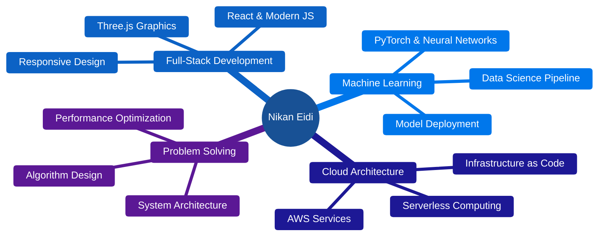

<div align="center">

# NIKAN EIDI


```ascii
    ╔════════════════════════════════════════════════════════════════╗
    ║                                                                ║
    ║     ██████╗ ██╗   ██╗██╗██╗     ██████╗ ██╗███╗   ██╗ ██████╗  ║
    ║     ██╔══██╗██║   ██║██║██║     ██╔══██╗██║████╗  ██║██╔════╝  ║
    ║     ██████╔╝██║   ██║██║██║     ██║  ██║██║██╔██╗ ██║██║  ███╗ ║
    ║     ██╔══██╗██║   ██║██║██║     ██║  ██║██║██║╚██╗██║██║   ██║ ║
    ║     ██████╔╝╚██████╔╝██║███████╗██████╔╝██║██║ ╚████║╚██████╔╝ ║
    ║     ╚═════╝  ╚═════╝ ╚═╝╚══════╝╚═════╝ ╚═╝╚═╝  ╚═══╝ ╚═════╝  ║
    ║                                                                ║
    ║           Tomorrow's Solutions • Today's Technology            ║
    ║                    Toronto, Canada • EST                       ║
    ║                                                                ║
    ╚════════════════════════════════════════════════════════════════╝
```


</div>

---

## Philosophy

```ascii
    ╭───────────────────────────────────────────────────────────────╮
    │                                                               │
    │   ┌─────────────────────────────────────────────────────┐     │
    │   │  "In the intersection of logic and creativity,      │     │
    │   │   innovation is born. Every line of code is an      │     │
    │   │   opportunity to build something meaningful."       │     │
    │   └─────────────────────────────────────────────────────┘     │
    │                                                               │
    │        ┏━━━━━━━━━━━━━━━━━━━━━━━━━━━━━━━━━━━━━━━━━┓            │
    │        ┃  Technical Precision + Creative Vision  ┃            │
    │        ┃              ↓                           ┃           │
    │        ┃      Impactful Solutions                ┃            │
    │        ┗━━━━━━━━━━━━━━━━━━━━━━━━━━━━━━━━━━━━━━━━━┛            │
    │                                                               │
    ╰───────────────────────────────────────────────────────────────╯
```

---

## Expertise Matrix

<div align="center">



</div>

---

## Technology Arsenal

<details open>
<summary><b>Core Languages</b></summary>
<br/>


</details>

<details>
<summary><b>Frontend Ecosystem</b></summary>
<br/>


</details>

<details>
<summary><b>Database Layer</b></summary>
<br/>


</details>

<details>
<summary><b>AI & Machine Learning</b></summary>
<br/>


</details>

<details>
<summary><b>Cloud & Infrastructure</b></summary>
<br/>


</details>

<details>
<summary><b>Development Environment</b></summary>
<br/>


</details>

---

## Performance Metrics

<div align="center">


</div>

---

## Continuous Learning Journey

```ascii
    ╔══════════════════════════════════════════════════════════════╗
    ║                      2025 LEARNING PATH                      ║
    ╠══════════════════════════════════════════════════════════════╣
    ║                                                              ║
    ║   ┌────────────────────────────────────────────────────┐     ║
    ║   │  FOCUS AREAS                                       │     ║
    ║   │  ├─► Advanced ML Architectures                     │     ║
    ║   │  ├─► Cloud-Native Development                      │     ║
    ║   │  └─► System Design Patterns                        │     ║
    ║   └────────────────────────────────────────────────────┘     ║
    ║                                                              ║
    ║   ┌────────────────────────────────────────────────────┐     ║
    ║   │  EXPLORING                                         │     ║
    ║   │  ├─► Distributed Systems                           │     ║
    ║   │  ├─► Microservices Architecture                    │     ║
    ║   │  └─► Real-time Data Processing                     │     ║
    ║   └────────────────────────────────────────────────────┘     ║
    ║                                                              ║
    ║   ┌────────────────────────────────────────────────────┐     ║
    ║   │  GOALS                                             │     ║
    ║   │  ├─► Open Source Contributions                     │     ║
    ║   │  ├─► Production-Scale AI Applications              │     ║
    ║   │  └─► AWS Solutions Architecture Mastery            │     ║
    ║   └────────────────────────────────────────────────────┘     ║
    ║                                                              ║
    ║         ━━━━━━━━━━━━━━━━━━━━━━━━━━━━━━━━━━━━━━━━             ║
    ║           "Bridging ML Research & Production"                ║
    ║         ━━━━━━━━━━━━━━━━━━━━━━━━━━━━━━━━━━━━━━━━             ║
    ║                                                              ║
    ╚══════════════════════════════════════════════════════════════╝
```

---

## Let's Build Something Great

<div align="center">


```ascii
    ╔═════════════════════════════════════════════════════════════════╗
    ║                                                                 ║
    ║              ███████╗ ██████╗ ██╗     ██╗      █████╗ ██████╗   ║
    ║              ██╔════╝██╔═══██╗██║     ██║     ██╔══██╗██╔══██╗  ║
    ║              ██║     ██║   ██║██║     ██║     ███████║██████╔╝  ║
    ║              ██║     ██║   ██║██║     ██║     ██╔══██║██╔══██╗  ║
    ║              ╚██████╗╚██████╔╝███████╗███████╗██║  ██║██████╔╝  ║
    ║               ╚═════╝ ╚═════╝ ╚══════╝╚══════╝╚═╝  ╚═╝╚═════╝   ║
    ║                                                                 ║
    ║   ┏━━━━━━━━━━━━━━━━━━━━━━━━━━━━━━━━━━━━━━━━━━━━━━━━━━━━━━━┓     ║
    ║   ┃                                                       ┃     ║
    ║   ┃   ▸ Full-Stack Development                            ┃     ║
    ║   ┃   ▸ Machine Learning & AI Integration                 ┃     ║
    ║   ┃   ▸ Cloud Architecture & DevOps                       ┃     ║
    ║   ┃   ▸ Open Source Contributions                         ┃     ║
    ║   ┃   ▸ Technical Consulting                              ┃     ║
    ║   ┃                                                       ┃     ║
    ║   ┗━━━━━━━━━━━━━━━━━━━━━━━━━━━━━━━━━━━━━━━━━━━━━━━━━━━━━━━┛     ║
    ║                                                                 ║
    ║        ╭─────────────────────────────────────────────╮          ║
    ║        │  "Great things are never done by one        │          ║
    ║         │   person. They're done by a team."          │          ║ 
    ║        │                        - Steve Jobs         │          ║
    ║        ╰─────────────────────────────────────────────╯          ║ 
    ║                                                                 ║
    ║   ┌───────────────┐  ┌───────────────┐  ┌────────────────┐      ║
    ║   │   RESPONSE    │  │  REMOTE READY │  │   TIME ZONE    │      ║
    ║   │     24h       │  │      YES      │  │   EST/Toronto  │      ║
    ║   └───────────────┘  └───────────────┘  └────────────────┘      ║
    ║                                                                 ║
    ╚═════════════════════════════════════════════════════════════════╝
```

<br/>

```javascript
class Collaboration {
  constructor() {
    this.status = "AVAILABLE";
    this.interests = [
      "Innovative Tech Solutions",
      "Scalable Architecture",
      "AI-Powered Applications",
      "Meaningful Impact Projects"
    ];
  }
  
  connect() {
    console.log("Let's turn ideas into reality →");
    return "📧 nikaneydi1984@gmail.com";
  }
}

const opportunity = new Collaboration();
opportunity.connect();
```

<br/>

<div align="center">
  <a href="https://www.linkedin.com/in/nikan-eidi-03476232b/">
    
  </a>
  <a href="https://nikanportfolio.onrender.com">
    
  </a>
  <a href="mailto:nikaneydi1984@gmail.com">
    
  </a>
</div>

<br/>


</div>
