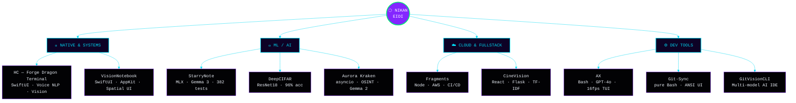

<div align="center">
  
</div>

<br/>

<div align="center">

[](https://git.io/typing-svg)

</div>

<br/>

<div align="center">
  
</div>

<br/>

<table align="center">
<tr>
<td width="50%" valign="top">

```python
# ~/.config/identity.py

name      = "Nikan Eidi"
location  = "Toronto, CA · UTC-5"
status    = "ONLINE — open to work"

languages = ["Python", "Swift", "TypeScript",
             "Java", "Bash", "SQL", "C/C++"]

ml_ai     = ["PyTorch", "scikit-learn", "MLX",
             "Gemma 2/3", "LangChain", "ONNX"]

systems   = ["SwiftUI", "MVVM", "Vision FW",
             "AVFoundation", "Metal / MPS"]
```

</td>
<td width="50%" valign="top">

```python
# ~/.config/stack.py

cloud     = ["AWS · S3 · DynamoDB",
             "Cognito · EC2 · ECR",
             "Docker", "GitHub Actions", "n8n"]

frontend  = ["React 19", "Vite", "Flask",
             "Streamlit", "Supabase",
             "Framer Motion", "Tailwind"]

mantra    = ["architecture > complexity",
             "ship fast, scale elegantly",
             "build for humans, not specs"]
```

</td>
</tr>
</table>

<br/>

<div align="center">


<br/><br/>


<br/><br/>


</div>

<br/>


```mermaid
%%{init: {'theme':'base','themeVariables':{'primaryColor':'#0d0226','primaryTextColor':'#F0F5FC','primaryBorderColor':'#8426FF','lineColor':'#00D8F2','fontFamily':'monospace'}}}%%
flowchart TB
    CORE(("⬡ NIKAN\nEIDI"))

    CORE --> NATIVE["📱 NATIVE & SYSTEMS"]
    CORE --> ML["🧠 ML / AI"]
    CORE --> CLOUD["☁️ CLOUD & FULLSTACK"]
    CORE --> TOOLS["⚙️ DEV TOOLS"]

    NATIVE --> HC["HC — Forge Dragon Terminal\nSwiftUI · Voice NLP · Vision"]
    NATIVE --> VN["VisionNotebook\nSwiftUI · AppKit · Spatial UI"]

    ML --> SN["StarryNote\nMLX · Gemma 3 · 382 tests"]
    ML --> DC["DeepCIFAR\nResNet18 · 96% acc"]
    ML --> AU["Aurora Kraken\nasyncio · OSINT · Gemma 2"]

    CLOUD --> FR["Fragments\nNode · AWS · CI/CD"]
    CLOUD --> CV["CineVision\nReact · Flask · TF-IDF"]

    TOOLS --> AX["AX\nBash · GPT-4o · 16fps TUI"]
    TOOLS --> GS["Git-Sync\npure Bash · ANSI UI"]
    TOOLS --> GV["GitVisionCLI\nMulti-model AI IDE"]

    classDef core fill:#8426FF,stroke:#00F273,stroke-width:3px,color:#fff
    classDef cat fill:#0d0226,stroke:#00D8F2,stroke-width:2px,color:#00D8F2
    classDef proj fill:#020204,stroke:#8426FF,stroke-width:1px,color:#F0F5FC
    class CORE core
    class NATIVE,ML,CLOUD,TOOLS cat
    class HC,VN,SN,DC,AU,FR,CV,AX,GS,GV proj
```

<br/>

<!-- HC -->

<table align="center">
<tr>
<td width="64%" valign="top">

### `⬡` HC — Midnight Forge Dragon Terminal

**`iPadOS` `SwiftUI` `MVVM` `NLP` `Vision Framework`**

Cyberpunk work-hour tracker on the Forge design system. Continuous voice command engine (Apple Speech + NaturalLanguage), front-camera hand-gesture control with One-Euro filter, and an ANSI dragon terminal rendered per-character.

</td>
<td width="36%" valign="top">

```
[SYS] Voice: ACTIVE
[VOX] "select the fifth"
[SYS] ghost-click → day 5
+==========================+
|     SESSION REPORT       |
| 5 Jun  07:00 → 16:00     |
| >>> Total: 9:00          |
+==========================+
root@hc:~$ _
```

</td>
</tr>
</table>

-----

<!-- STARRYNOTE -->

<table align="center">
<tr>
<td width="36%" valign="top">

```
⚡ neural init      [OK]
🔍 deep scan        [OK]
🧠 synthesis        [OK]
📊 mission report   [OK]
──────────────────────
density  ✦✦✦✦✦
tests    382 / 382
```

</td>
<td width="64%" valign="top">

### `⬡` StarryNote — Knowledge Architect

**`Python` `MLX` `Gemma 3` `Apple Silicon` `Rich TUI`**

Local-first AI study engine. Feeds any file — PDF, image, code, notes — through Gemma 3 on Metal GPU and synthesizes a 10-section study guide with original proofs, Mermaid diagrams, and exam questions. Triple-layer post-processor. 100% test pass rate.

</td>
</tr>
</table>

-----

<!-- AURORA -->

<table align="center">
<tr>
<td width="64%" valign="top">

### `⬡` Aurora Marine — The Kraken Engine

**`Python` `asyncio` `Gemma 2` `OSINT` `Metal GPU`**

AI-driven intelligence pipeline. 12-layer identity resolution across 15+ concurrent async leads, speculative TLD probing, and a local AI Surgeon (Gemma 2-2B) that reads non-standard DOMs when regex fails. 150+ cached leads/sec.

</td>
<td width="36%" valign="top">

```
[KRAKEN] v28.0 · Metal
01 Identity Vault    ✓
03 Nitro Guessing    ✓
05 Nitro Spidering   ✓
08 AI Surgeon Pivot  ✓
11 Geo-Fencing       ✓
12 Master Sync       ✓
status: FORTIFIED
```

</td>
</tr>
</table>

-----

<!-- AX -->

<table align="center">
<tr>
<td width="36%" valign="top">

```
IDLE → SCANNING → BUILDING
→ REQUESTING → PARSING
→ WRITING → DONE

[eye ◉ OPEN]
███████████░░░░░░░░ 50%
⠹ consulting gpt-4o...
```

</td>
<td width="64%" valign="top">

### `⬡` AX — Cybernetic Workflow Architect

**`Bash` `GPT-4o` `OpenAI API` `ANSI` `TUI`**

Single-file Bash utility that fingerprints your stack and dispatches to GPT-4o for a production CI workflow — while a 16fps Cybernetic Eye animates in terminal via pure `tput`. Ghost-dependency isolation prevents phantom build steps.

</td>
</tr>
</table>

-----

<!-- CINEVISION -->

<table align="center">
<tr>
<td width="64%" valign="top">

### `⬡` CineVision — AI Movie Tracker

**`React 19` `Flask` `Supabase` `scikit-learn` `TMDB`**

Full-stack tracker with a TF-IDF cosine-similarity engine over 10,000+ titles. Liquid Glass UI, Coverflow search, episode-level progress, and real-time watchlist-driven recommendations.

</td>
<td width="36%" valign="top">

```
POST /recommend
{ "watchlist": [
    {movie: 550},
    {tv: 1399} ],
  "limit": 20 }
→ 200 OK
  [20 tailored picks]
```

</td>
</tr>
</table>

-----

<!-- DEEPCIFAR -->

<table align="center">
<tr>
<td width="36%" valign="top">

```
ResNet18 · ImageNet
device: MPS · 6 epochs
─────────────────────
val   96.62%
test  96.02%
─────────────────────
cat       79.55%
airplane   2.98%
```

</td>
<td width="64%" valign="top">

### `⬡` DeepCIFAR — Image Classification

**`PyTorch` `ResNet18` `MPS` `Transfer Learning`**

End-to-end CIFAR-10 classifier. Transfer learning with pretrained ResNet18 fine-tuned on Apple Silicon, AdamW + CosineAnnealingLR, full inference CLI. 96.02% test accuracy in 6 epochs.

</td>
</tr>
</table>

<br/>

<div align="center">


&nbsp;


<br/><br/>


<br/>


<br/><br/>


<br/><br/>

<!-- Holopin badges -->

<a href="https://holopin.io/@nikaneidi">
  
</a>

</div>

<br/>

<div align="center">

[](https://www.linkedin.com/in/nikan-eidi-03476232b/)
[](https://nikanvision.dev)
[](mailto:nikaneydi1984@gmail.com)
[](https://dev.to/nikaneidi)

<br/>


 

 


<br/>

```
╔════════════════════════════════════════════════════╗
║  "Technology is not about solving problems —       ║
║   it's about reimagining what's possible."         ║
║                                      — Nikan Eidi  ║
╚════════════════════════════════════════════════════╝
```

</div>


